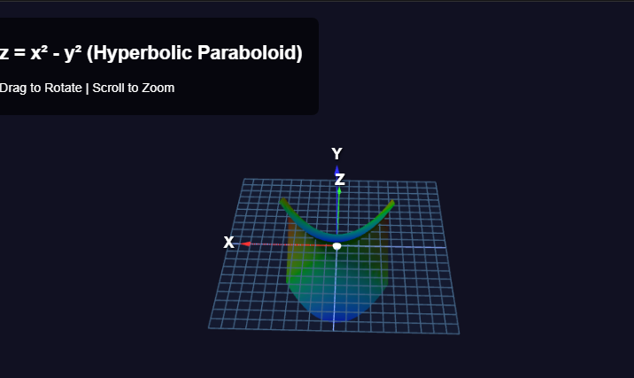

Here is a professional `README.md` file tailored to your Unit 7 Programming Assignment. You can copy this directly into a file named `README.md`.

***

# 3D Function Grapher (Three.js)



## 📖 Overview
This project is a 3D mathematical function grapher built using JavaScript and the **Three.js** library. It was developed as the **Unit 7 Programming Assignment**.

The program generates a 3D surface mesh by evaluating a mathematical function in the form \(z = f(x, y)\) over a grid of input values ranging from -1 to 1.

## ✨ Features
*   **Function Evaluation:** Plots any function \(z = f(x,y)\) defined within the code.
*   **Interactive Controls:** Users can **Rotate** (Drag) and **Scale/Zoom** (Scroll) the graph using the mouse.
*   **Reference Elements:**
    *   **Axis Helper:** Colorful 3D arrows and labels representing X (Red), Y (Blue), and Z (Green) axes.
    *   **Grid Plane:** A wireframe reference plane at the origin (\(z=0\)) to visualize the surface height.
*   **Color Mapping:** Vertices are color-coded based on their Z-value (height) for better visual depth.
*   **Responsive:** Automatically adjusts to window resizing.

## 🧮 Sample Function (Included)
The current code is pre-configured to graph the **Hyperbolic Paraboloid** (saddle shape):

\[
z = x^2 - y^2
\]

*(This fulfills the assignment requirement for one of the specific shapes).*

## 🚀 How to Run
1.  **Download** the `index.html` file (or the code from the grapher).
2.  **Open** the file in any modern web browser (Chrome, Firefox, Edge).
    *   *Note: No server is strictly required, but if you encounter CORS issues, use a local server like VS Code's "Live Server".*

## 🛠️ Technology Stack
*   **Three.js (r157)** – 3D rendering engine.
*   **OrbitControls** – Mouse interaction (Rotation/Pan/Zoom).
*   **CSS2DRenderer** – High-quality text labels for axes.

## 📝 Usage & Interaction
1.  **Rotate:** Click and drag the mouse anywhere on the screen.
2.  **Zoom:** Use the mouse scroll wheel to zoom in/out.
3.  **View:** The scene defaults to looking at the origin (0,0,0).

## 🔧 Customizing the Function
To graph a different function, locate the `evaluateFunction(x, y)` function in the JavaScript section (around line 60):

```javascript
// Current Function: Hyperbolic Paraboloid
function evaluateFunction(x, y) {
    return (x * x) - (y * y); 
}
```
/
├── index.html          # Single-file solution (HTML + Embedded JS)
├── README.md           # Project documentation
└── screenshot.png      # (Optional) Image of the graphed function
```

## 📚 Assignment Criteria Checklist
| Requirement | Status |
| :--- | :--- |
| Graphs a given function (\(z = f(x,y)\)) | ✅ |
| Includes a specific formula (Hyperbolic Paraboloid) | ✅ |
| Mouse controls (Rotate & Scale) | ✅ |
| Axis Helper (X, Y, Z arrows and labels) | ✅ |
| Reference Plane at Origin | ✅ |
| Well documented code | ✅ (Liberally commented in JS) |

## 👤 Author
Uwabor Collins - Unit 7 - Programming Assignment - CS 4406
```